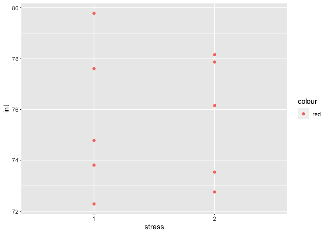
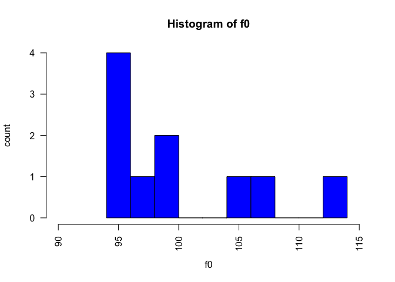
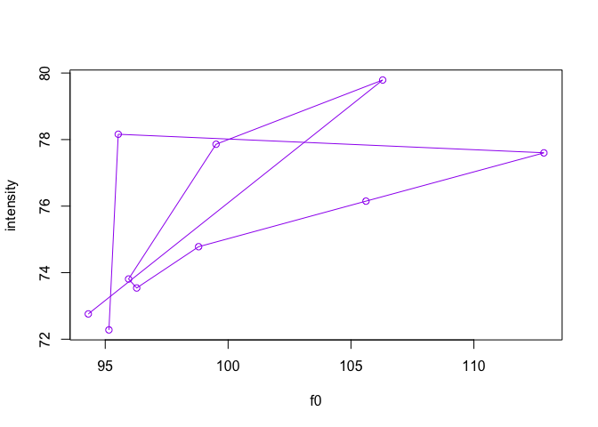

# Programming Assignment 2

## Load library

``` r
library(tidyverse)
```

    ## ── Attaching packages ────────────── tidyverse 1.3.0 ──

    ## ✓ ggplot2 3.3.0     ✓ purrr   0.3.3
    ## ✓ tibble  2.1.3     ✓ dplyr   0.8.3
    ## ✓ tidyr   1.0.0     ✓ stringr 1.4.0
    ## ✓ readr   1.3.1     ✓ forcats 0.4.0

    ## ── Conflicts ───────────────── tidyverse_conflicts() ──
    ## x dplyr::filter() masks stats::filter()
    ## x dplyr::lag()    masks stats::lag()

## Read data into R

``` r
read_csv("data/data.csv")
```

    ## Parsed with column specification:
    ## cols(
    ##   info = col_character(),
    ##   durationV = col_double(),
    ##   f0 = col_double(),
    ##   int = col_double()
    ## )

    ## # A tibble: 10 x 4
    ##    info    durationV    f0   int
    ##    <chr>       <dbl> <dbl> <dbl>
    ##  1 capo_1       0.07  95.2  72.3
    ##  2 capo_2       0.06  95.5  78.2
    ##  3 pinto_1      0.1  113.   77.6
    ##  4 pinto_2      0.06 106.   76.2
    ##  5 pujo_1       0.08  98.8  74.8
    ##  6 pujo_2       0.06  96.3  73.5
    ##  7 quemo_1      0.1   96.0  73.8
    ##  8 quemo_2      0.07  99.5  77.9
    ##  9 testo_1      0.1  106.   79.8
    ## 10 testo_2      0.05  94.3  72.8

## Assign to an object

``` r
my_data <- read_csv("data/data.csv")
```

    ## Parsed with column specification:
    ## cols(
    ##   info = col_character(),
    ##   durationV = col_double(),
    ##   f0 = col_double(),
    ##   int = col_double()
    ## )

## Mean duration

``` r
mean(my_data$durationV)
```

    ## [1] 0.075

## Mean f0

``` r
mean(my_data$f0)
```

    ## [1] 100.028

## Mean intensity

``` r
mean(my_data$int)
```

    ## [1] 75.673

## Separate variable Info into different columns (word, stress)

``` r
separate(data = my_data, col = info, into = c("word", "stress"), sep = "_")
```

    ## # A tibble: 10 x 5
    ##    word  stress durationV    f0   int
    ##    <chr> <chr>      <dbl> <dbl> <dbl>
    ##  1 capo  1           0.07  95.2  72.3
    ##  2 capo  2           0.06  95.5  78.2
    ##  3 pinto 1           0.1  113.   77.6
    ##  4 pinto 2           0.06 106.   76.2
    ##  5 pujo  1           0.08  98.8  74.8
    ##  6 pujo  2           0.06  96.3  73.5
    ##  7 quemo 1           0.1   96.0  73.8
    ##  8 quemo 2           0.07  99.5  77.9
    ##  9 testo 1           0.1  106.   79.8
    ## 10 testo 2           0.05  94.3  72.8

## Assign it to an object

``` r
my_new_data <- separate(data = my_data, col = info, into = c("word", "stress"), sep = "_")
```

## Means by lexical stress

### Means of durationV for stress 1 and 2

``` r
my_new_data %>%
  group_by(stress) %>%
  summarize(mean_durationV = mean(durationV))
```

    ## # A tibble: 2 x 2
    ##   stress mean_durationV
    ##   <chr>           <dbl>
    ## 1 1                0.09
    ## 2 2                0.06

### Means of f0 for stress 1 and 2

``` r
my_new_data %>%
  group_by(stress) %>%
  summarize(mean_f0 = mean(f0))
```

    ## # A tibble: 2 x 2
    ##   stress mean_f0
    ##   <chr>    <dbl>
    ## 1 1        102. 
    ## 2 2         98.2

### Means of int for stress 1 and 2

``` r
my_new_data %>%
  group_by(stress) %>%
  summarize(mean_int = mean(int))
```

    ## # A tibble: 2 x 2
    ##   stress mean_int
    ##   <chr>     <dbl>
    ## 1 1          75.7
    ## 2 2          75.7

## Create plots

### Plot of intensity for each stress type

``` r
my_new_data %>%
  ggplot(., aes(x = stress, y = int, col = "red"))+
  geom_point()
```

<!-- -->

### Histogram of f0

``` r
hist(my_new_data$f0, 
     main="Histogram of f0", 
     xlab="f0", 
     ylab = "count",
     border="black", 
     col="blue",
     xlim=c(90,115),
     las=2, 
     breaks=10)
```

<!-- -->

### Point plot of intensity and f0

``` r
plot(x = my_new_data$f0 , y = my_new_data$int, type = 'o', xlab = "f0", ylab = "intensity", col = "purple")
```

<!-- -->
